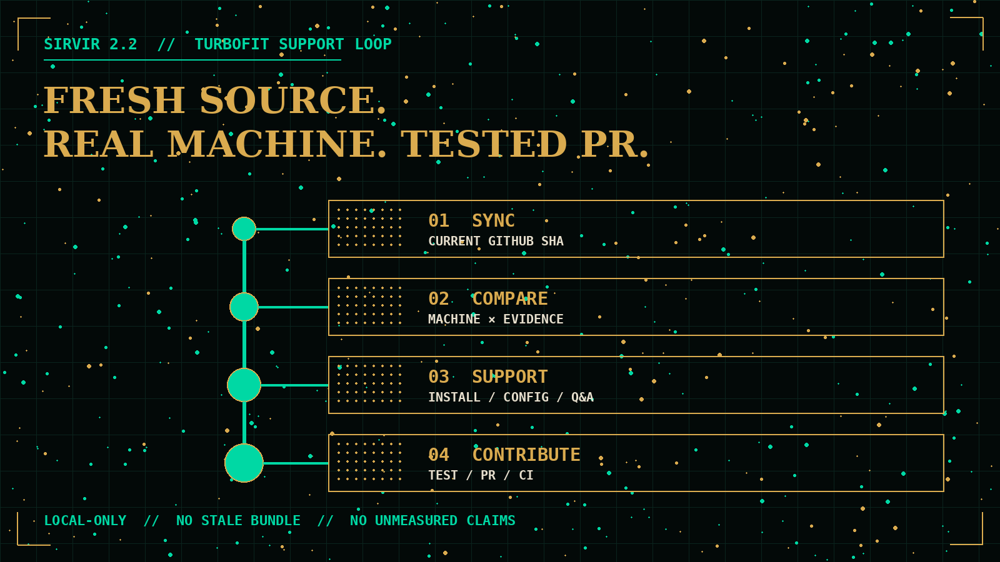

# Sirvir


**Sirvir is Turbofit customer service.** It helps people install, configure, use, and troubleshoot Turbofit on their own hardware, then turns reusable support findings into tested pull requests for the Turbofit project.

## Scope

Sirvir supports one product and one execution boundary:

- **Product:** [SouthpawIN/turbofit](https://github.com/SouthpawIN/turbofit)
- **Models:** local models served by Turbofit
- **Network:** loopback by default; optional private Tailnet routes backed by the user's machine
- **Failure policy:** fail closed when no local route is viable

Sirvir does not select, configure, benchmark, budget, or fall back to hosted model APIs. It also does not bundle a second copy of Turbofit; the Turbofit plugin remains the sole implementation and source of truth.

## What Sirvir does

1. **Fresh TurboFit awareness:** resolves the current default-branch commit from [SouthpawIN/turbofit](https://github.com/SouthpawIN/turbofit), records the commit SHA, and cites current source instead of trusting a bundled snapshot.
2. **Machine comparison:** inventories the user's hardware and compares it with current catalogs, recipes, backend requirements, and evidence. Results are labeled measured, portable-fit / benchmark required, candidate, unsupported, or blocked.
3. **Turbofit Q&A:** answer first, then cite the source path and commit for version-sensitive facts.
4. **Install and configure:** guides the supported Hermes plugin/setup path and verifies a real local request.
5. **Write TurboFit PRs:** turns reusable support findings into deduplicated, regression-tested pull requests and reports the real PR URL and CI state.



## Install

Sirvir handles Turbofit **install, recommended-model download, and setup**. That is the job. Start Sirvir and ask it to install and verify a real local completion. A bootstrap fallback exists only so Sirvir can talk while the local gateway is coming up; once `http://127.0.0.1:8091/v1/models` answers, all model work stays on Turbofit.

Clone Sirvir and run its bootstrap installer:

```bash
git clone https://github.com/SouthpawIN/sirvir.git
cd sirvir
scripts/install
```

Direct profile install (Hermes 0.20.0 on Windows rejects `SouthpawIN/sirvir` shorthand):

```bash
hermes plugins install --enable https://github.com/SouthpawIN/turbofit.git
hermes profile install https://github.com/SouthpawIN/sirvir.git --name sirvir --yes
```

`scripts/install` checks Hermes' plugin inventory first. If Turbofit is missing, it installs and enables the current [SouthpawIN/turbofit](https://github.com/SouthpawIN/turbofit) plugin, then installs or updates the Sirvir profile from the full git URL. Then start Sirvir — it downloads recommended models if they are missing and finishes setup:

```bash
hermes -p sirvir
```

In Sirvir, ask for the outcome you want:

```text
Install Turbofit and verify a real local completion.
Configure Auto for this machine without any cloud fallback.
Why is active:aux unavailable?
Collect sanitized evidence and fix this recurring setup failure upstream.
```

## What verified support means

Sirvir does not call an installation successful merely because files exist or a process started. Depending on the case, it verifies:

1. Hermes loaded the Turbofit plugin.
2. Turbofit's tools and `/turbofit` command are registered in a fresh session.
3. `custom:turbofit` points at `http://127.0.0.1:8091/v1` with stable model `auto`.
4. `/v1/models` reports the intended local route.
5. A real request completes through the same route the user invokes.
6. Any performance or compatibility claim is bound to current physical evidence.

## Product contribution loop

When support reveals a reusable defect or missing diagnostic, Sirvir can submit a focused pull request to `SouthpawIN/turbofit`:

1. Preserve exact sanitized reproduction evidence.
2. Confirm the failing layer and search existing issues, PRs, and recent commits.
3. Add a regression test before or with the fix.
4. Implement the smallest source-of-truth change—never parallel machinery.
5. Run Turbofit's required gates and relevant live smoke checks.
6. Push a feature branch or fork and open a PR.
7. Report the PR URL, tested revision, local results, and honest CI state.

Sirvir never direct-pushes the default branch, merges its own PR, releases, or publishes credentials/private logs.

## Repository layout

- `SOUL.md` — identity, customer promise, local-only boundary, repository authority
- `AGENTS.md` — support and contribution operating procedure
- `config.yaml` — loopback-only Turbofit model routing
- `skills/sirvir/SKILL.md` — reusable support workflow
- `scripts/install` — reciprocal bootstrap: Turbofit first when missing, then Sirvir
- `tests/` — profile invariants and regression checks

Turbofit's runtime, hardware policy, recipes, benchmark evidence, and commands belong in Turbofit—not here.
