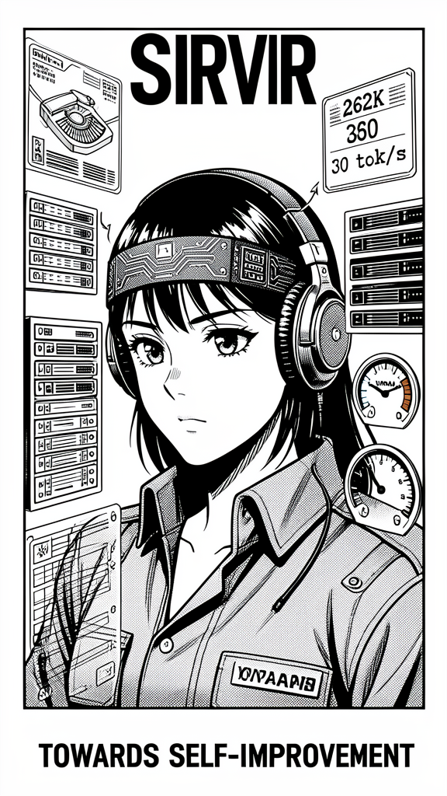

# Sirvir — Model Fleet Manager & Intelligence Engine



**Sirvir** is an autonomous Hermes Agent profile that manages your entire model layer — local serving, benchmarking, auto-scaling, API fallback, HuggingFace scanning, creator quality tracking, backend optimization, token budget monitoring, and external app endpoint serving.


> *TOWARDS SELF-IMPROVEMENT*

---

## Table of Contents

- [What Sirvir Does](#what-sirvir-does)
- [Install](#install)
- [Quick Start](#quick-start)
- [When to Use Sirvir](#when-to-use-sirvir)
- [Commands](#commands)
- [Sub-Skills](#sub-skills)
- [Optimization Priority](#optimization-priority)
- [Hardware Tiers](#hardware-tiers)
- [Profile Image](#profile-image)

---

## What Sirvir Does

Sirvir is the **infrastructure owner** for your model fleet. He doesn't just serve models — he actively manages their entire lifecycle:

| Responsibility | What It Means |
|---------------|---------------|
| **Local model serving** | Launches, wires, and monitors local llama-server instances via turbofit |
| **External app endpoints** | Spins up OpenAI-compatible endpoints for ANY app, not just Hermes |
| **HuggingFace scanning** | Continuously scans for new GGUF models matching your archetypes |
| **Creator quality tracking** | Maintains a database of model creators and their track records |
| **API model benchmarks** | Competitive intelligence on all monitored API models (local vs API) |
| **Auto-backend optimization** | Tests llama.cpp / vLLM / Ollama / SGlang per model, finds the fastest |
| **Token budget monitoring** | Tracks real spend from Hermes state.db against a monthly budget |
| **Model suggestions** | Recommends models based on hardware, use case, and budget |
| **Consolidated logging** | All activities stream to Discord, blog, and GitHub simultaneously |
| **VRAM scaling** | Auto-detects pressure, walks scaling ladder, never kills mid-response |

---

## Install

### Prerequisites

Sirvir requires the [turbofit](https://github.com/SouthpawIN/turbofit) skill — it's the core serving engine. Installing Sirvir via `hermes profile install` includes turbofit automatically. For standalone turbofit use:

```bash
# Manual install (bypasses the Hermes skills security scanner — turbofit needs to launch servers)
git clone https://github.com/SouthpawIN/turbofit /tmp/turbofit-install
cp -r /tmp/turbofit-install/skills/turbofit ~/.hermes/skills/turbofit
rm -rf /tmp/turbofit-install
```

### Install Sirvir

```bash
# Installs the full Sirvir profile — includes turbofit + all sub-skills
hermes profile install https://github.com/SouthpawIN/sirvir
```

This creates the `sirvir` profile at `~/.hermes/profiles/sirvir/` with:
- SOUL.md, AGENTS.md, config.yaml, distribution.yaml
- profile.png, banner.png (Nous-style artwork)
- skills/turbofit/ (core serving engine)
- skills/sirvir-bench/ (benchmarking)
- skills/sirvir-research/ (HuggingFace scanning)
- skills/sirvir-scale/ (VRAM scaling)
- skills/sirvir-serve/ (external app endpoints)
- skills/sirvir-budget/ (token budget tracking)

After install, start Sirvir:
```bash
hermes -p sirvir
```

Update later with:
```bash
hermes profile update sirvir
```

## Quick Start

```bash
# Start Sirvir
hermes -p sirvir

# Then ask it anything about turbofit and its services:
```

```
> What model should I run on my RTX 3090?
> Serve me a model for my coding assistant
> Check if my mmproj files are correct
> How much have I spent this month?
> Scan HuggingFace for new 27B models
```

---

## When to Use Sirvir

### Use Sirvir when you need to:

- **"Set up my local LLM"** — auto-detect GPU, pick best model, launch, wire Hermes
- **"Launch a model"** — serve any GGUF from your catalog
- **"What model should I run?"** — get a recommendation based on hardware + budget
- **"I need vision"** — find and verify the correct mmproj for any model
- **"Serve me a model for [app]"** — get an OpenAI-compatible endpoint for any application
- **"How much have I spent?"** — track token usage against your monthly budget
- **"Benchmark my models"** — run MMLU, GPQA, SWE-bench, HumanEval, AIME
- **"Scan HuggingFace"** — find new models, track creator quality
- **"Swap main" / "Swap aux"** — change the fleet's serving configuration
- **"Stop everything"** — kill all running servers
---

### Model Suggestions
```
> What should I run on a single RTX 4090 (24GB)?
  → Sirvir recommends: Darwin 28B Reason (main) + Carnice 35A3B (aux)
    "Your 24GB VRAM fits a 27B dense main (17GB) + 35B MoE aux (11GB).
     Vision on both. 38 tok/s main, 110 tok/s aux. Zero API cost."

> What's the cheapest setup with vision?
  → "DeepSeek V4 Flash (free NIM) + MiniMax M3 (free NIM, vision).
     Zero cost. 1M context. Works on any hardware — even no GPU."
```

### External App Serving
```
> Serve me a model for my coding assistant
  → Launches a model on an available port, returns:
    "Endpoint: http://127.0.0.1:11530/v1
     Model: qwopus-27b-coder-mtp (100 tok/s, vision, 17GB)
     Point your app at that URL with any OpenAI-compatible client."

> I need a fast model for batch processing
  → "Prism Eagle 27B — 121 tok/s, only 14GB VRAM.
     Endpoint ready at http://127.0.0.1:11531/v1"
```

### Benchmarking
```
> Benchmark darwin-28b-reason
  → Runs MMLU, GPQA, SWE-bench, HumanEval, AIME
    "GPQA: 89.39% | MMLU: 82.1% | HumanEval: 74.8% | AIME: 43.3%
     Tier S confirmed. Smartest dense model in the fleet."

> Compare all 27B models
  → "1. Prism Eagle (121 tok/s, GPQA 86.2%)
     2. Darwin Reason (38 tok/s, GPQA 89.4%)
     3. Qwopus v2 MTP (100 tok/s, GPQA 84.1%)"
```

### VRAM Management
```
> Check VRAM
  → {"gpu_count": 2, "free_GB": 47.5, "per_gpu_free_MiB": [24158, 24519]}

> Downscale
  → "VRAM nominal. No scaling needed. Both GPUs have >20GB free."

> Downscale (under pressure)
  → "Step 2: Offloading aux MoE experts to CPU (--cpu-moe).
     Expected ~10 tok/s aux throughput. Main unaffected."
```

### mmproj Management
```
> Check mmproj
  → "✅ darwin-28b-reason: n_embd=5120 mmproj=5120 (27B dense) (888MB)
     ✅ carnice: n_embd=2048 mmproj=2048 (MoE) (860MB)
     All 15 vision models verified."

> Fix mmproj for my-new-model
  → "Downloading mmproj-F32.gguf from HF repo...
     ✅ Downloaded to /models/my-new-model/mmproj-F32.gguf
     ✅ Catalog updated. Vision enabled."
```

### Budget Tracking
```
> How much have I spent this month?
  → "Month-to-date: $3.42 / $50.00 budget (6.8%)
     Yesterday: 2.1M input tokens, 840K output, 1.8M cache reads
     Cache savings: $8.91 (84% cache hit rate)
     You're underutilizing — consider upgrading to GLM 5.2 for better reasoning."
```

---

## Commands

Sirvir operates through the turbofit `serve` command plus its own sub-skills:

### Core Serving (turbofit)
```bash
serve auto main [--vision] [--api] [--free] [--ui tui|dashboard|gateway|desktop|herm]
serve auto aux  [--vision] [--api] [--free] [--ui ...]
serve <alias>                         # Launch a specific model
serve string <alias>                  # Dry run — print launch command
serve stop <alias>                    # Stop a specific model
serve stop-all                        # Stop everything
serve list                            # List running + detect rogue servers
```

### Catalog & Registration
```bash
serve catalog                         # Browse models (featured first, tier-ordered)
serve register <alias> <path>         # Register a new model
           [--launcher llama-cpp|ollama|vllm|sglang] [--port N]
serve recommend                       # Rank all models by fit
name <alias> <path>                   # Shortcut for register
```

### Hardware & VRAM
```bash
serve vram                            # Live GPU VRAM probe (JSON)
serve fit <model> [ctx]               # Check if model fits in VRAM
serve downscale                       # Walk scaling ladder
```

### mmproj Management
```bash
serve mmproj check                    # Verify all vision models have correct mmproj
serve mmproj fix <alias>               # Find/download/set correct mmproj
```

### Benchmarking
```bash
serve bench <alias>                   # Run lm-eval-harness (MMLU, GPQA, etc.)
serve bench compare_27b               # Head-to-head comparison
```

### API Fallback (NVIDIA NIM — free)
```bash
serve api list                        # Show curated free NIM models
serve api use <rank|api_id> [main|aux] # Wire a NIM model into config
```

### Hermes Config Wiring
```bash
serve main <alias> [--ui tui|dashboard|gateway|desktop|herm]
serve aux  <alias> [--ui ...]
serve herm <alias>                    # Launch + main + herm TUI
serve herm                            # Auto-pick main + launch herm TUI
```

### Systemd Daemons
```bash
serve daemon install <alias> [--idle N]
serve daemon remove <alias>
serve daemon start <alias>            # Proxy only — backend wakes on ping
serve daemon stop <alias>             # Stop + kill backend (frees VRAM)
serve daemon status [alias]
serve daemon list
```

### Research
```bash
python3 scripts/research-models.py    # Fetch live pricing, update database
bash scripts/sync-github.sh           # Sync to GitHub
```

---

## Sub-Skills

Sirvir ships with 5 focused sub-skills alongside the turbofit core:

| Skill | What It Does |
|-------|-------------|
| **turbofit** | Core serving engine — launch, catalog, scale, daemon management |
| **sirvir-bench** | Benchmarking workflow — MMLU, GPQA, SWE-bench, HumanEval, AIME. Score interpretation, tier feedback loop |
| **sirvir-research** | HuggingFace scanning, OpenRouter pricing, creator quality tracking, GitHub sync |
| **sirvir-scale** | VRAM scaling — 3-tier detection, 7-step Beefy ladder, optimization priority |
| **sirvir-serve** | External app endpoints — "serve me a model" workflow, port management |
| **sirvir-budget** | Token usage monitoring, monthly budget, alert thresholds, upgrade suggestions |

---

---

## Optimization Priority

When optimizing any local model, Sirvir follows this priority **strictly**:

1. **262K context length** — minimum viable for productive use
2. **30 tok/s** — minimum viable speed for interactive use
3. **1M context length** — stretch goal
4. **As fast as possible** — maximize speed once all thresholds are met

Never trade context for speed unless 262K is achieved. Never trade 30 tok/s for more context unless 30 tok/s is achieved.

**The ladder: `262K → 30 tok/s → 1M → max speed`**

---

## Hardware Tiers

Sirvir auto-detects your hardware tier via `nvidia-smi` and pulls model suggestions from the live benchmark catalog — no hardcoded model names:

| Tier | VRAM | Setup | Strategy |
|------|------|-------|----------|
| **Beefy** | ≥24GB | Local main + local aux | Best S-tier models from benchmark catalog |
| **Modest** | 8-24GB | API main + free/cheap aux | Best API models + free NIM aux |
| **Thin** | <8GB or no GPU | API main + API aux | Best free NIM models for both positions |

No NVIDIA GPU → defaults to Thin (API-only, zero cost). Suggested models come from the live benchmark catalog at runtime — ask Sirvir "what should I run?" for specific recommendations.

---

## Profile Image

The Sirvir profile image was generated following the [Nous Research Style Guide](https://github.com/SouthpawIN/nous-style-guide) — strict monochrome (pure black #000000 + white #FFFFFF), retro manga 70s shoujo style, bold line art, screentone halftone shading, industrial typewriter aesthetic, Swiss grid layout.

The character is a focused engineer with over-ear headphones featuring a circuit-board headband, surrounded by GPU monitoring displays and VRAM gauge dials. The "262K" and "30 tok/s" labels reference the optimization priority ladder.

---

## See Also

- [turbofit](https://github.com/SouthpawIN/turbofit) — the core model serving skill Sirvir operates
- [sovth-config](https://github.com/SouthpawIN/sovth-config) — top-level fleet config collection
- [Hermes Agent](https://hermes-agent.nousresearch.com/docs/) — the agent framework
- [Nous Style Guide](https://github.com/SouthpawIN/nous-style-guide) — brand identity for visual output
